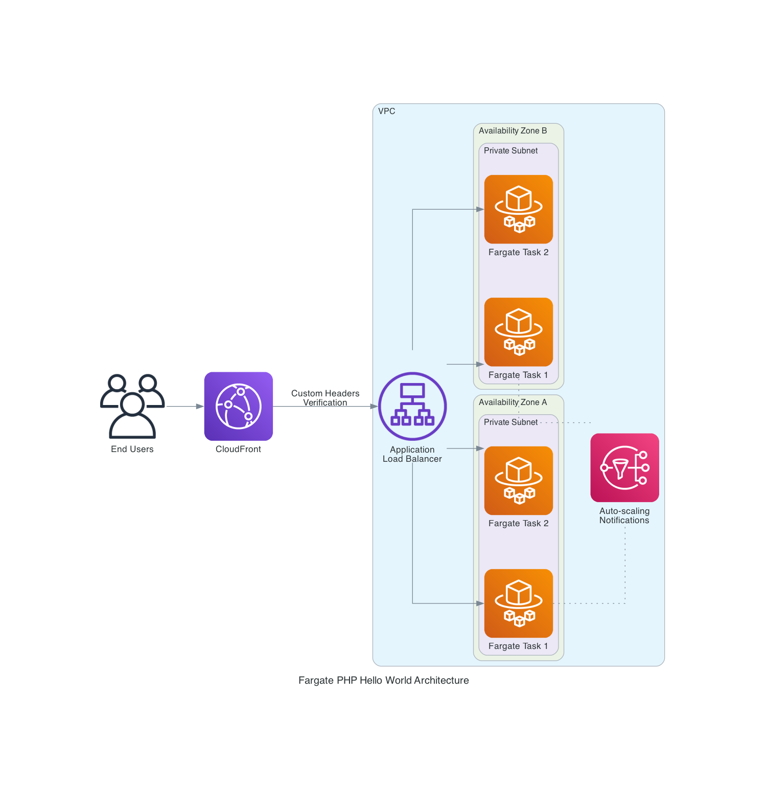

# Fargate PHP Hello World with CDK

This project deploys a simple PHP application on AWS Fargate with CloudFront, demonstrating high availability across multiple availability zones.

## Architecture Diagram



The diagram above illustrates the high-availability architecture with:
- CloudFront distribution for content delivery
- Application Load Balancer distributing traffic
- Fargate tasks running across multiple availability zones
- Auto-scaling capabilities based on CPU utilization

## Project Structure

```
fargate-php-hello-cdk/
├── app/                    # PHP application and Docker files
│   ├── Dockerfile          # Docker configuration for PHP image
│   ├── index.php           # PHP application displaying environment information
│   └── task-definition.json # ECS task definition (for reference)
├── app.py                  # CDK code to deploy the infrastructure
├── architecture_diagram.py # Python script to generate the architecture diagram
├── architecture_diagram.png # Visual representation of the architecture
├── cdk.json                # CDK configuration
└── README.md               # This file
```

## Features

- Simple PHP application that displays information about the runtime environment
- Deployment on AWS Fargate with high availability (2+ tasks)
- Distribution of tasks across multiple availability zones
- CloudFront distribution for caching and security
- CPU-based auto-scaling
- **Secured public ALB** that only accepts traffic from CloudFront

## Security Implementation

This architecture implements a secure public ALB that only accepts traffic from CloudFront through a custom header verification mechanism:

1. **Custom Header Verification**: 
   - CloudFront adds a custom header (`X-Origin-Verify: private-alb-access`) to all requests sent to the ALB
   - The ALB is configured with a listener rule that checks for this header
   - If the header is present and has the correct value, the request is forwarded to the Fargate tasks
   - If the header is missing or incorrect, the ALB returns a 403 Forbidden response

2. **Security Testing**:
   - Direct access to the ALB without the custom header results in a 403 Forbidden response
   - Access through CloudFront works correctly as it automatically adds the required header
   - Even if someone discovers the custom header, they would need to come from a CloudFront IP address

This approach provides a good balance between security and simplicity, without requiring additional services like AWS Global Accelerator or complex VPC configurations.

> **IMPORTANT NOTE**: This implementation uses a public ALB instead of a private one for simplicity. While CloudFront can connect to private ALBs using VPC Origins, this requires additional configuration including VPC endpoints and potentially SSL certificates if using HTTPS. For demonstration purposes, we've implemented a secured public ALB that only accepts traffic from CloudFront through custom headers, which provides a good balance between security and simplicity.

## Benefits of this Architecture

- **Enhanced Security**: The ALB only accepts traffic from CloudFront through header verification
- **High Availability**: Distribution of tasks across multiple availability zones
- **Performance**: CloudFront caches static content and reduces latency
- **DDoS Protection**: CloudFront includes AWS Shield Standard
- **Scalability**: Automatic CPU-based auto-scaling

## Accessing the Application

After deployment, the access URLs are displayed in the CloudFormation stack outputs:

- **CloudFrontURL**: URL of the CloudFront distribution (use this to access the application)
- **LoadBalancerDNS**: URL of the ALB (secured to only accept traffic from CloudFront)

## Prerequisites

- Configured AWS CLI
- Node.js and npm installed
- Python 3.6+ and pip installed
- AWS CDK installed (`npm install -g aws-cdk`)

## Deployment

1. Create a Python virtual environment and install dependencies:

```bash
python -m venv .venv
source .venv/bin/activate  # On Windows: .venv\Scripts\activate
pip install -r requirements.txt
```

2. Deploy the application:

```bash
cdk deploy
```

3. Access the application via the CloudFront URL displayed in the deployment outputs.

## Cleanup

To remove all resources:

```bash
cdk destroy
```

## Operation

The application displays:
- The availability zone where the container is running
- A unique instance ID
- Information about the runtime environment

By refreshing the page, you'll see that requests are distributed between different instances in different availability zones, demonstrating the high availability of the architecture.
